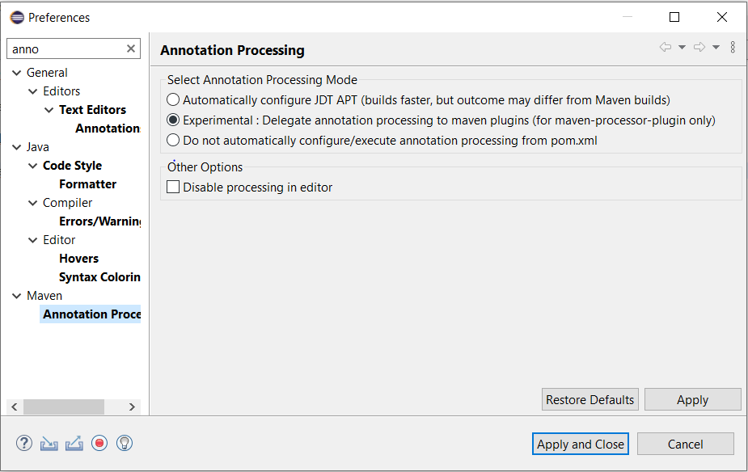

# Sistema de gestion de Stock

Para levantar el proyecto en Eclipse, importarlo como proyecto maven.

Para que compilen las referencias a las clases generadas, instalar m2e-apt.

Una vez instalado configurarlo de la siguiente forma
Windows > Preferences > Maven > Annotation processing

